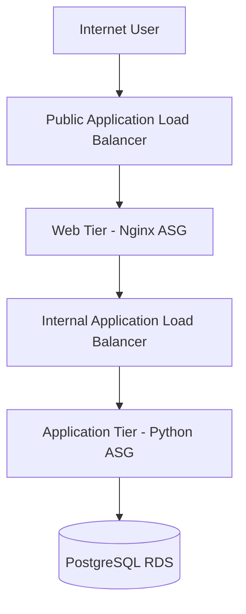

# Yuva Internship – Week 2: Cloud Automation & Infrastructure as Code

## Project
**Multi-Tier Cloud Application Deployment using Terraform on AWS**

This project demonstrates Infrastructure as Code (IaC) by deploying a three-tier application environment:

1. **Web tier** – Nginx EC2 Auto Scaling Group behind a public Application Load Balancer.
2. **Application tier** – Python HTTP application servers in private subnets behind an internal Application Load Balancer.
3. **Database tier** – PostgreSQL on Amazon RDS in private database subnets.

Terraform creates the VPC, subnets, route tables, security groups, IAM role, load balancers, EC2 launch templates, Auto Scaling Groups, scaling policies, and RDS database.

## Architecture



## Prerequisites
- AWS account with permissions to create VPC, EC2, ALB, Auto Scaling, IAM, and RDS resources.
- Terraform >= 1.6.
- AWS CLI configured with an appropriate IAM identity.
- Git installed.

## Setup

```bash
aws configure
aws sts get-caller-identity

cd terraform
cp terraform.tfvars.example terraform.tfvars
# Edit terraform.tfvars and set a strong DB password.

terraform init
terraform fmt -recursive
terraform validate
terraform plan
terraform apply
terraform output
```

Open `terraform output -raw application_url` in a browser.

## Expected response
A successful request returns JSON from the application tier, including the EC2 hostname. This helps demonstrate that the public ALB and web tier are forwarding traffic to the private application tier.

## Security design
- RDS is private and is not publicly accessible.
- PostgreSQL 5432 is allowed only from the application security group.
- Application port 5000 is allowed only from the internal ALB.
- Web port 80 is allowed only from the public ALB.
- EC2 uses IMDSv2 and Systems Manager IAM permissions.
- Real credentials and Terraform state are excluded from Git.

## Testing checklist
- [ ] `terraform fmt -recursive`
- [ ] `terraform validate`
- [ ] `terraform plan`
- [ ] `terraform apply`
- [ ] Public ALB targets healthy
- [ ] Internal ALB targets healthy
- [ ] Browser/API test successful
- [ ] Both ASGs show desired capacity
- [ ] RDS available and private
- [ ] `terraform destroy` completed after testing

## Evidence to capture
Capture screenshots from your own AWS account for:
1. Terraform validate
2. Terraform plan
3. Terraform apply
4. VPC and subnets
5. Public ALB target health
6. Internal ALB target health
7. Auto Scaling Groups
8. RDS status
9. Application response in browser
10. Monitoring/CPU metrics

## Cleanup
AWS resources can incur charges. After completing the demonstration:

```bash
terraform destroy
```

Do not upload fake AWS screenshots. Use screenshots from your actual deployment.


## Submission Note
This repository is prepared for the Week 2 internship submission. It contains the Terraform Infrastructure as Code and supporting documentation for the requested multi-tier AWS architecture. It does not claim a live AWS deployment because no AWS account was used.
